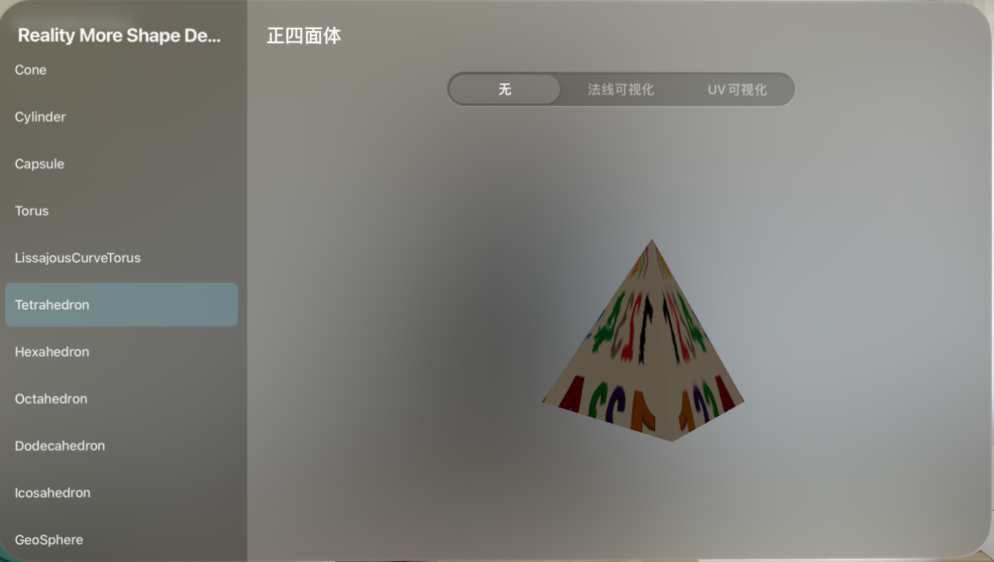
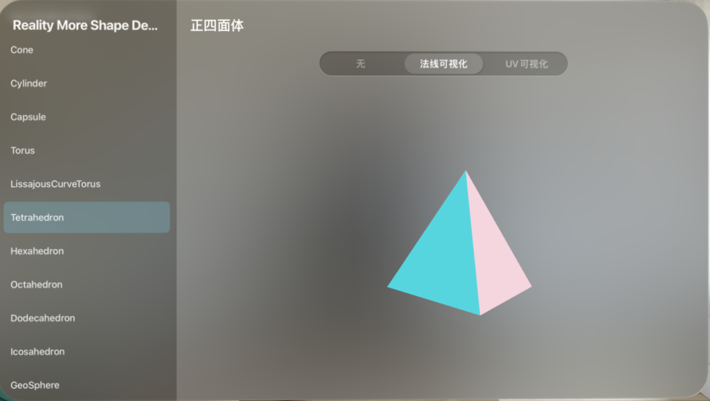
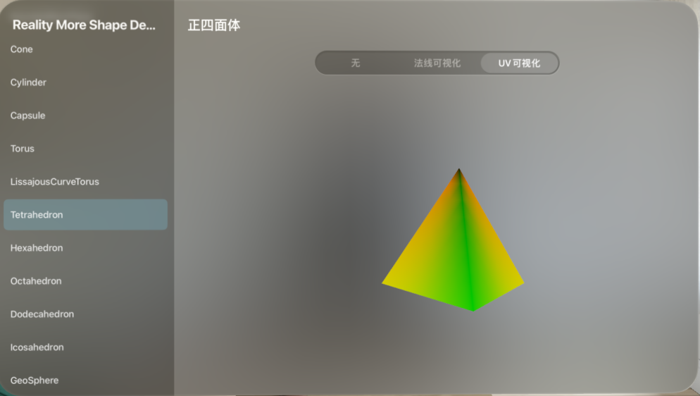

# RealityMoreShape


<p align="center">

</p>

<p align="center">

  <a href="https://github.com/apple/swift-package-manager"></a>

  

  

</p>


Extending the built-in Geometry types in RealityKit, for iOS and visionOS.

扩展 RealityKit 中的内置几何体类型，适用于 iOS 和 visionOS。


## Requirements 需求


- visionOS 1.0+/iOS 15.0+


## Usage 使用

```swift
//iOS
var m = PhysicallyBasedMaterial()
m.baseColor = .init(tint: .white, texture:.init(try! TextureResource.load(named: "number.jpeg", in: nil)))

do {
    let mesh = try MeshResource.generateCirclePlane(radius:0.1, angularResolution: 30, radialResolution: 5, circleUV: true)
    let model = ModelEntity(mesh:mesh, materials: [m])
    model.position.y = 0.1
    model.name = "model"
} catch {
    print(error)
}


//visionOS
RealityView { content in
    var m = PhysicallyBasedMaterial()
    let texture = try! await TextureResource.init(named: "number.jpeg")
    m.baseColor = .init(tint: .white, texture:.init(texture))
    
    do {
        let mesh = try MeshResource.generateCirclePlane(radius:0.1, angularResolution: 30, radialResolution: 5, circleUV: true)
        let modelEntity = ModelEntity(mesh:mesh, materials: [m])
        modelEntity.name = "model"
        content.add(modelEntity)
    } catch {
        print(error)
    }
}


```


## Demo

In the Demo, you can see the shape of every Geometry type. And you can also choose to display DebugOptions of `normal` and `uv`.

在演示 Demo 中，你可以看到所有几何体形状，并且可以选择调试选项，以可视化方式查看 `法线` 和 `贴图坐标（UV）`。







## Installation 安装


#### Swift Package Manager（SPM）


To integrate using Apple's Swift package manager, add the following as a dependency to your `Package.swift`:

使用苹果 Swift package manager 集成，可在项目中的 `Package.swift` 中添加依赖：


```

.package(url: "https://github.com/XanderXu/RealityMoreShape.git", .upToNextMajor(from: "0.1.0"))

```


#### Manually 手动


[Download](https://github.com/XanderXu/RealityMoreShape/archive/master.zip) the project and copy the `RealityMoreShape` folder into your project to use it.

下载项目源码，并拖动到你的工程文件中使用。


## Contact 联系方式


Xander: API 搬运工  

* [https://twitter.com/XanderARKit](https://twitter.com/XanderARKit)

* [https://github.com/XanderXu](https://github.com/XanderXu)

* [https://juejin.cn/user/2629687543092056](https://juejin.cn/user/2629687543092056)


## License 证书


RealityMoreShape is released under an MIT license. See [LICENSE](./LICENSE) for more information.
